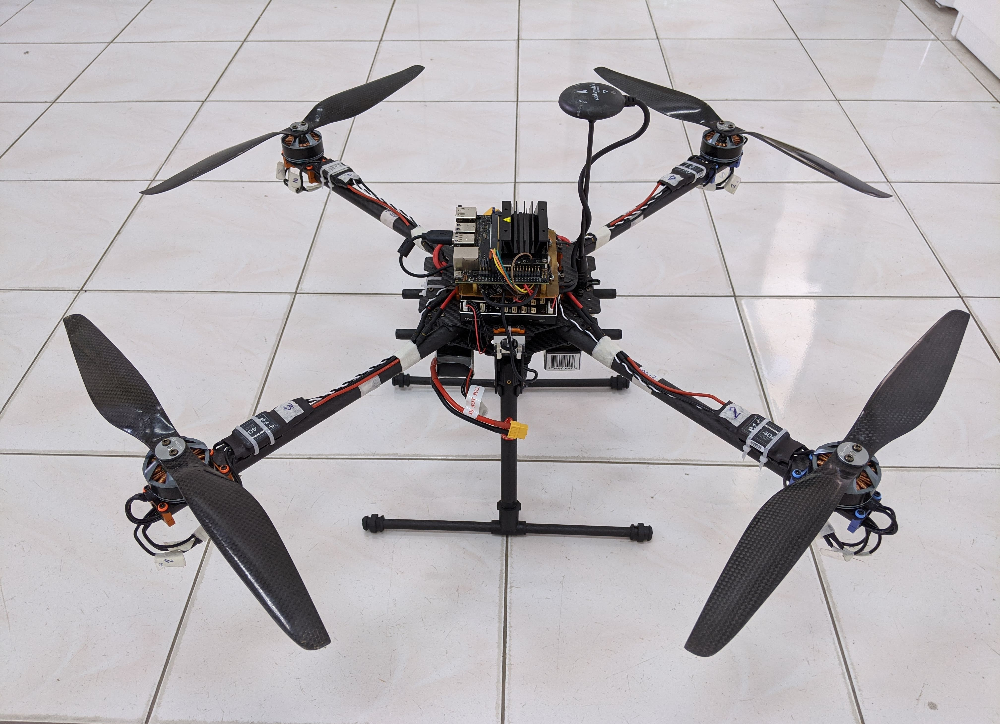

## <span style="color:green">Drone Project Github Page</span>

### OFFBOARD

---

> <span style="color:red">WARNING</span> 
> 
> OFFBOARD control is dangerous.<br>If you are operating on a real vehicle be sure to have a way of gaining back manual control in case something goes wrong.

---

This project is developed to use the onboard computer for controlling the drone. 

It is based on ROS and MAVROS and includes some features:

- Keep drone hover at the certain height in configured time
- Perform a flight that follow the setpoints: local or global setpoint
- Input setpoints from keyboard or set in a config file

Simualtion based: 
> ROS Melodic (Ubuntu 18.04) - [ros-melodic-desktop-full](http://wiki.ros.org/melodic/Installation/Ubuntu)
>
> MAVROS - [instruction here](https://docs.px4.io/master/en/ros/mavros_installation.html#binary-installation-debian-ubuntu)
>
> PX4 Firmware - [v10.0.1](https://github.com/congtranv/Firmware)
>
> Gazebo 9 - install with ROS

Quadrotor for test: 

- **Frame and Power:** 
  - Frame: Tarot Ironman 650 foldable
  - Motor: T-Motor MN4010 KV580 - 4 units
  - Prop: Cacbon (DJI form) 15x5.5in (CW and CCW) - 2 units
  - ESC: Hobbywing XRotor 40A - 4 units
  - Battery: 4s 1800mAh 45c - Two Units
  - Power management: Pixhawk PM07 - 1 unit
  - BEC: 5V 4A - 1 unit

- **Flight control and Sensor:** 
  - Flight control: Holybro Pixhawk 4 - 1 unit
  - GPS: Pixhawk Neo-M8N GPS module - 1 unit
  - Onboard computer: NVIDIA Jetson Nano - 1 unit

- **Communication:**
  - Receiver: Frsky X8R - 1 unit
  - Transmitter: Frsky Taranis Q X7 - 1 unit

### Hovering
- Get current position from drone via mavros topic
- Input a height (z) from keyboard to hover
- Set a target position with x = current position x, y = current position y and z = z input
- Get time to hover from a config file
- Publish target to drone and keep it hover in setup time
- Land after timeout

<figure class="video_container">
  <video width="480" height="270" controls>
    <source src="video/hovering.mp4" type="video/mp4">
    <source src="video/hovering.ogg" type="video/ogg">
    <source src="video/hovering.webm" type="video/webm">
  </video>
</figure>

### Setpoint
- Get current position from drone via mavros topic, include local position and global position

  **local position**: position in x, y, z coordinates. Unit: meter
  
  **global position**: position in GPS: latitiude, longitude and altitude
- Choose position type:
  
  **local position**: target can be input from keyboard or load from config file
  
  **global position**: target also can be input or load as local position. after get target, have a conversion from GPS to x, y, z
- Publish target to drone and check when drone reach it. Continue until the final setpoint
- At each setpoint drone hover in a time. And at final setpoint, drone land after timeout

<figure class="video_container">
  <video width="480" height="270" controls>
    <source src="video/setpoints.mp4" type="video/mp4">
    <source src="video/setpoints.ogg" type="video/ogg">
    <source src="video/setpoints.webm" type="video/webm">
  </video>
</figure>


<!-- 
```markdown
Syntax highlighted code block

# Header 1
## Header 2
### Header 3

- Bulleted
- List

1. Numbered
2. List

**Bold** and _Italic_ and `Code` text

[Link](url) and 
``` 

For more details see [GitHub Flavored Markdown](https://guides.github.com/features/mastering-markdown/). 

<details>
<summary markdown="span">First level collapsible item</summary>
**Lorem ipsum dolor sit amet...**
<details>
<summary markdown="span">Second level collapsible item</summary>
*Sed ut perspiciatis unde omnis iste natus...*
</details>
</details>

-->

<!-- 
### Jekyll Themes

Your Pages site will use the layout and styles from the Jekyll theme you have selected in your [repository settings](https://github.com/congtranv/offboard/settings/pages). The name of this theme is saved in the Jekyll `_config.yml` configuration file.

### Support or Contact

Having trouble with Pages? Check out our [documentation](https://docs.github.com/categories/github-pages-basics/) or [contact support](https://support.github.com/contact) and we’ll help you sort it out.
-->
